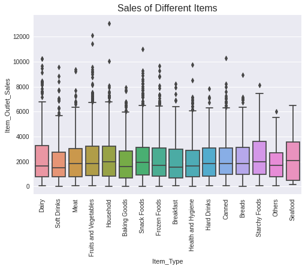

# Sales Pedictions

Using Machine Learning models like linear Regression to make Sales predictions

# An overview of the project
The project goes through different ways of data visualization and how data can be predicted using machine learning models like linear regression and Decision Tree Regressor. 

# Relevant insights from the data.
Some of the data was visualized with heat map which helped show the correlation between the different data provided. As you can see in the heatmap below there is a moderate correlation between Item Outlet Sales and Item MRP. 

The box plot below shows the price range of the different item types. The median in the interquartile range is from 1600 to 2500. Apart from Seafood, the other item_types have some outliers.

The data was split, passed through a pipeline inorder to stop it from leaking into the test data which I wanted to make predictions to. 

# Summary of the model and its evaluation metrics

Having sampled different models, I chose to go with Random Forest Regressor for prediction. The evaluated model which was computed with the R Squared Score gave me an output of 0.55 which translates into 55%, meaning that the model can explain 55% of the variation in the target which are the sales prices. 

At the end, no one metric told the whole story. It was just important to examine and understand multiple metrics for each model.
